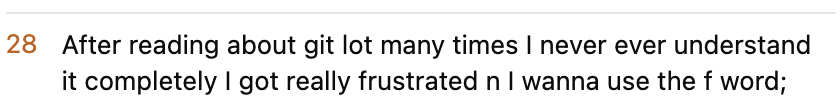
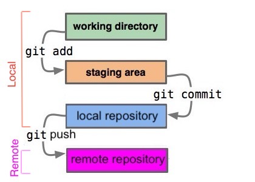
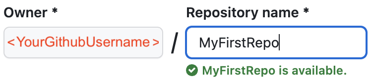

<!-- markdownlint-disable MD033 -->

# **Intro git Guide (WIP)**

<!-- ## :construction: TODOs :construction:

<details>
  <summary>Click here to collapse/expand TODOs </summary>

| :construction: TODOs :construction: |
|-|
| Remove TODOs |
| Fix numbering/ordering |
| List prereq skills/tools |
| <details><summary>Ensure consistent phrasing/formatting</summary>"To A, run B", "the C above", etc.</details> |
| Ensure imperative/command voice |
| Ensure visual aids captioned and near where relevant |
| git remote add \<alias\> \<url\> in/near git push section |
| manually resize images and save in repo for clean(er) lint |

</details> -->

<!-- - [Purpose and Scope](#purpose-and-scope)
- [Background](#background)
- [Installation](#installation)
  - [Check if git is already installed (git version)](#installation)
  - [Windows](#windowsInstall)
  - [macOS](#macosInstall)
  - [Linux](#linuxInstall)

<!-- - Conclusion
- if this was too difficult just use GitHub Desktop for now. -->

<!-- from https://stackoverflow.com/questions/3689838/whats-the-difference-between-head-working-tree-and-index-in-git -->
<!--  -->

<!--  -->

## **1. Purpose and Scope**

**1.1.** This guide aims to provide a cursory introduction to git and the command line. 

**1.2.** This guide aims to bridge the gap between a simple git reference sheet lacking elaboration and the overwhelming minutiae of git's official documentation.

**1.3.** This guide is intended for beginners to both git and the command line.

**1.4.** This guide avoids some terms used in official contexts in favor of common alternatives that are more easily understood (e.g. the state between the working directory and the local repo will be referred to as the staging area instead of the index).

**1.5.** This guide covers:

> **1.5.1.** How to upload to and download from a remote git repository using some essential git commands.

> **1.5.2.** Some important git concepts (working directory, staging area, local repository, remote repository).

> **1.5.3.** Some essential directory and file commands (`cd`, `ls`, `mkdir`).

> **1.5.4.** Some general command line tips (<kbd>&#8593;</kbd>, <kbd>&#8595;</kbd>, <kbd>Ctrl</kbd> + <kbd>c</kbd>, <kbd>q</kbd>, `:wq`, `:q!`, `[optionalVal]`, `<requiredVal>`).

**1.6.** This guide does not cover:

> **1.6.1.** The majority of git commands, concepts, and usages.

> **1.6.2.** Distinctions between the command line, shell, terminal, and console.

> **1.6.3.** Distinctions between different operating systems, file systems, shells, etc.

> **1.6.4.** Distinctions between absolute and relative file paths.

**1.7.** In practice I hope that this guide will alleviate some common growing pains (pictured below) while learning git on the command line.

<!-- 661x956 originally -->
<!-- 

 -->

|||
|--|--|

## **2. Background**

**2.1.** The basic idea of version control can easily be understood by some common tangible examples:

> **2.1.1.** The collaborative and history features of Google Docs that track every edit to the document is an example of version control.

> **2.1.2** The collaborative and history features of Wikipedia that track every edit to a wiki page is an example of version control.

**2.2.** The basic importance of version control can easily be understood by contrasting it with its messy and ineffective alternative (pictured below):

<!-- 532x884 originally -->


**2.3.** Git conceptualizes changes as existing in 1 of 4 states (3 locally, 1 remotely).

> **2.3.1.** Basically this means that making local changes available remotely requires a multi step process (pictured below; save modified file, run `git add`, run `git commit`, run `git push`).

<!-- original from https://stackoverflow.com/questions/3689838/whats-the-difference-between-head-working-tree-and-index-in-git -->


**2.4.** The working directory is a normal directory where files are stored for a project. in this guide the working directory is named `MyFirstRepo` (because a git local repository will be intialized here later on).

 > **2.4.1.** The working directory is created by `mkdir`.

> **2.4.2.** The working directory exists locally at `~/Desktop/Repos/MyFirstRepo`.

 > **2.4.3.** Changes are in the working directory state after a file inside of it is modified and saved.

**2.5.** The staging area is an intermediate state that "prepares for launch" (upload). It's like tedious but essential bureaucratic paperwork.

<!-- Is an intermediate state between the working directory and the local repository that prepares for launch (upload).

an intermediate state between the working directory and the local repository. -->

> **2.5.1.** The staging area is created by `git init`.

> **2.5.2.** The staging area exists locally at `~/Desktop/Repos/MyFirstRepo/.git/index`.

> **2.5.3.** Changes are in the staging area state after `git add` is run.

**2.6.** The local repository is a "ready for launch" (upload) state.

<!-- a hidden directory [[X]](#hiddenDirFtnt) named `.git` inside the working directory. This is how git works it's "magic". -->

> **2.6.1.** The local repository is Created by `git init`.

> **2.6.2.** The local repository exists locally at `~/Desktop/Repos/MyFirstRepo/.git`.

> **2.6.3.** Changes are in the local repository state after `git commit` is run.

**2.7.** The remote repository is an online copy of a local repository.

> **2.7.1.** The remote repository is created by GitHub's `Create a new repository` page.

> **2.7.2.** The remote repository exists remotely at `https://github.com/<YourGithubUsername>/MyFirstRepo.git`.

> **2.7.3.** Changes are in the remote repository state after `git push` is run.

<!-- https://en.wikipedia.org/wiki/Command-line_interface#Arguments
Command description syntax

Built-in usage help and man pages commonly employ a small syntax to describe the valid command form:[22][23][24][nb 2]

angle brackets for required parameters: ping <hostname>
square brackets for optional parameters: mkdir [-p] <dirname>
ellipses for repeated items: cp <source1> [source2…] <dest>
vertical bars for choice of items: netstat {-t|-u}

Notice that these characters have different meanings than when used directly in the shell. Angle brackets may be omitted when confusing the parameter name with a literal string is not likely. -->

<!-- *** -->

## **3. General Command Line Tips and Tricks**

**3.1.** Press the <kbd>&#8593;</kbd> (up) and <kbd>&#8595;</kbd> (down) arrow keys to cycle through recently run commands.

**3.2.** If stuck in a command line help or man(ual) page, press <kbd>q</kbd> to quit.

**3.3.** If stuck in a command line text editor after running a git command, it's probably stuck in vim (git's default editor).

> **3.3.1.** To write (save) and quit vim, press <kbd>Esc</kbd>, then type `:wq`, then press <kbd>Enter</kbd>

> **3.3.2.** To quit vim **without saving**, press <kbd>Esc</kbd>, then type `:q!`, then press <kbd>Enter</kbd>

**3.4.** If stuck in a command line program where all else fails to quit, try <kbd>Ctrl</kbd> + <kbd>c</kbd> (convential shortcut for interupting the currently running command line program). [[7]](#ftntX)

<!-- label/emoji boxes from https://stackoverflow.com/a/58758521 -->

| :exclamation:  IMPORTANT   |
|----------------------------|

**3.5.** Often in online examples, documentation, help pages, man(ual) pages, etc., it's common to see command pseudocode that encloses a value between square or angle brackets. This **IS NOT** actually valid command syntax. These are conceptual **placeholders** with specific meanings. [[1]](#ftnt1)

> **3.5.1.** Square brackets (like `[optionalVal]`) means you _may_ supply a  value in its place.

> **3.5.2** Angle brackets (like `<requiredVal>`) means you **MUST** supply a value in its place.

**3.6.1.** For example when running `git help`, it outputs  a big list of angle and square brackets. Looking at a very simplified interpretation:

```text
git <command> [<args>]
```

> **3.6.1.** The output above means that the user is required to supply git a `<command>`, and that depending on the given `<command>`, the `[<args>]` are either required or optional.

**3.7.** Copy commands that have these brackets still, but make sure to delete all occurences of the brackets and fill in the appropriate value(s).

***

| :memo:        Note |
|--------------------|

**3.8.** On GitHub, all code blocks (like the one below) have a "copy to clipboard" button on the right. Use this button when learning commands to avoid syntax errors.

```text
echo hello world
```

> **3.8.1.** Remember to press the <kbd>Enter</kbd> key after pasting and editing the command (if applicable).

***

**3.9.** These icons indicate that the next step or info is OS-specific.

  

***


**3.10.** Windows users should follow along using PowerShell to run these commands.

***

 

**3.11.** MacOS and Linux users should follow along using Terminal to run these commands.

<!-- (There are other options but these are suggested for simplicity, for some cross compatability (`cd` and `ls` are aliased in PowerShell), and because they're preinstalled). -->

***

## **4. Installation**

**4.1** To check if git is already installed, run:

```text
git version
```

> **4.1.1** If the command above outputs any version number, everything is ready to go. Proceed to the [Directory and File Commands](#5-directory-and-file-commands) section.

> **4.1.2** If the command above outputs something like `command not found`, or shows a popup, git isn't installed. Proceed to the OS-specific installation steps below that correspond to your OS.

<!-- , and then verify that it installed correctly by re-running `git version`. -->

***

<a name="windowsInstall" id="windowsInstall"></a>


**4.2.** On Windows, to check if your OS is 32 or 64 bit, run:

```text
wmic os get osarchitecture
```

> **4.2.1.** Download the 32 bit or 64 bit installer that corresponds to the output above from [[2]](#winInstallFtnt). Open the installer and click through the steps with the preselected defaults.

**4.3.** To verify that git installed correctly, quit PowerShell, then re-open it, then re-run:

```text
git version
```

***

<a name="macosInstall" id="macosInstall"></a>


**4.4.** On macOS git usually comes preinstalled. If after running `git version`, a popup says something like `command line developer tools required`, click install.

<!--  -->

**4.5.** To verify that git installed correctly, quit Terminal, then re-open it, then re-run:

```text
git version
```

**4.6.** If git still isn't installed on your Mac, run:

```text
brew --version
```

> **4.6.1.** If the command above outputs something like `command not found`, Homebrew needs to be installed.

**4.7.** To install Homebrew, run:

```text
/bin/bash -c "$(curl -fsSL https://raw.githubusercontent.com/Homebrew/install/HEAD/install.sh)"
```

> **4.7.1.** Homebrew is a popular package manager for macOS. [[3]](#brewFtnt)

**4.8.** To install git via Homebrew, run:

```text
brew install git
```

**4.9.** To verify that git installed correctly, quit Terminal, then re-open it, then re-run:

```text
git version
```

***

<a name="linuxInstall" id="linuxInstall"></a>


**4.10.** On Linux git sometimes comes preinstalled.

**4.11.** If git still isn't installed on your Linux machine, use your distribution's package manager to install it. For distribution-specific details see [[4]](#linuxInstallFtnt).

**4.12.** To verify that git installed correctly, quit Terminal, then re-open it, then re-run:

```text
git version
```

***

## **5. Directory and File Commands**

**5.1.** The plan here is to create the working directory at `~/Desktop/Repos/MyFirstRepo` and create a new `MyFile.txt` inside it.

**5.2.** To change directory (`cd`) into the current user's `Desktop` directory, run:

```text
cd ~/Desktop
```

> **5.2.1.** The `~` in the command above is a shortcut that means the current user's "home" directory (i.e. where the `Desktop` subdirectory is located).

**5.3.** To list (`ls`) names of files and subdirectories inside the current `Desktop` directory, run:

```text
ls
```

> **5.3.1.** The command above helps provide context and a sense of location when navigating the file system.

**5.4.** To make a new directory (`mkdir`) inside the current user's `Desktop` directory, run:

```text
mkdir Repos
```

> **5.4.1.** The `Repos` directory is a uniform location to hold local repositories. I like to keep all my local git repos (school, work, and personal) in a wrapper directory like this so that whenever I need to run git commands I know to start with `cd ~/Desktop/Repos`.

**5.5.** To change directory (`cd`) into the new `Repos` directory, run:

```text
cd Repos
```

**5.6.** To make a new directory (`mkdir`) inside the `Repos` directory, run:

```text
mkdir MyFirstRepo
```

> **5.6.1.** At this point `MyFirstRepo` is technically just a working directory, but it's named this way because it will be where a git local repository is initialized later on.

**5.7.** To change directory (`cd`) into the new `MyFirstRepo` directory, run:

```text
cd MyFirstRepo
```

**5.8** To create a new text file inside the `MyFirstRepo` directory, run:

```text
echo "hello world" > MyFile.txt
```

> **5.8.1.** The command above creates a file named `MyFile.txt` which contains the text `hello world`. This file will be uploaded to the remote repository later on.

**5.9.** The working directory at `~/Desktop/Repos/MyFirstRepo` is now created and contains `MyFile.txt`

<!-- Instead, make a new directory (`mkdir`) inside our Desktop directory to hold our git repositories in a uniform location. I like to keep all my git repos (school, work, and personal) in a wrapper directory like this so that whenever I need to run git commands I know to start with `cd ~/Desktop/Repos`. -->

## **6. Configuration**

<!-- TODO Rename (from git config) and include creating remote repo steps. -->

Some configuration is required before beginning.

| :memo:         Note     |
|-------------------------|

These aren't login credentials to any hosting site. They're just values associated to your commits.

| :exclamation:  IMPORTANT   |
|----------------------------|

However, it can be especially important to set these in some situations, like to earn credit for school projects.

To set the username associated to your commits, replace the string literal's value with your username, then run:

```text
git config --global user.name "My Username"
```

To set the email associated to your commits, replace the string literal's value with your email, then run:

```text
git config --global user.email "myemail@test.com"
```

## **7. git help**

**7.1.** To  git help, run:

```text
git help
```

> **7.1.1.** The command above lists common git commands next to a brief description. On its own this probably isn't very helpful. However it suggests other more helpful usages of `git help` (shown below).

***

**7.2.** Notice that `git help` suggests more ways ("see also") to run this command:

```text
git help tutorial
git help everyday
git help revisions
git help workflows
```

***

**7.3.** To list all commands, run:

```text
git help -a
```

**7.4.** To learn more about a command, run:

```text
git help <command>
```

> **7.4.1.** The `<command>` in the command above is the name of one of the commands listed by `git help -a`.

***

**7.5.** To list all concept guides, run:

```text
git help -g
```

**7.6.** To learn more about a concept, run:

```text
git help <concept>
```

> **7.6.1.** The `<concept>` in the command above is the name of one of the concepts listed by `git help -g`.

***

## **8. git init**

<!-- 
To initialize the existing working directory (`~/Desktop/Repos/MyFirstRepo`) as a git local repository, run: -->

**8.1.** To initialize a git local repository inside the current working directory, run:

```text
git init
```

## **9. git status**

**9.1.** To check the state of the working directory and staging area, run:

```text
git status
```

> **9.1.1.** The `Your branch is` section shows whether the states of the local repository the remote repository are in sync (because this guide only uses 1 branch: main).

> **9.1.2.** The `Changes to be committed` section shows the state of the staging area.

> **9.1.3.** The `Changes not staged for commit` section shows the state of the working directory.

## **10. git add**

**10.1.** To move all changes from the working directory to the staging area, run:

```text
git add .
```

> **10.1.1.** The `.` in the command above specifies the current directory which git interprets as all changes in the current directory.

## **11. git commit**

<!-- TODO: To x run y format

TODO: Repeat string literal val replace phrasing for parallelism/clarity - prev mentioned before/above the cmd. -->

<!-- Commit takes whatever files were `add`ed (to the staging area) and records the changes to your local repository. -->

**11.1.** To move all changes from the staging area to the local repository, run:

```text
git commit -m "my first commit message"
```

> **11.1.1.** The `-m` option in the command above specifies the message string associated with the commit.

## **12. git push**

**12.1.** To create the remote repository, go to https://github.com/new, then login if you're not already, then enter `MyFirstRepo` for the `Repository name` text field, then click the `Create repository` button (pictured below).




<!-- ? Run this after `add`ing and `commit`ing to `push` (upload) local changes to the remote repo. If you `add` and `commit`, but forget to `push`, nobody will be able to see the changes. -->

**12.2.** To tell git where the remote repository is located, run:

```text
git remote add origin https://github.com/<YourGithubUsername>/MyFirstRepo
```

> **12.2.1.** Replace the `<YourGithubUsername>` in the command above with your GitHub username. Remember to delete the angle brackets.

**12.3.** To upload changes from the local repository to the remote repository **for the first push only**, run:

```text
git push -u origin main
```

> **12.3.1.** The `-u origin main` in the command above allows `git push` and `git pull` to be run without arguments from now on.

 <!-- git the default branch to push to so that future runs of ` -->

**12.4.** To upload changes from the local repository to the remote repository **for subsequent pushes**, run:

```text
git push
```

## **13. git pull**

| :exclamation:  IMPORTANT   |
|----------------------------|

**13.1.** Pull early and often to keep in sync with the remote repository and to prevent merge conflicts!

**13.2.** To download changes from the remote repository to the local repository and working directory, run:

```text
git pull
```

<!-- 
# Clean Messy Footer / Notes to Self / scratchpad section

https://git-scm.com/video/get-going

https://git-scm.com/downloads

These aren't credentials for any site - just key vals to associate with commits

git config --global user.name "MyName"

git config --global user.email "usr@test.com"

git init myProject

cd myProject

git add file1.txt

git commit -m "my first commit message" -->

## **14. References**

<a name="ftnt1" id="ftnt1"></a>
[[1]: https://stackoverflow.com/a/23242584](https://stackoverflow.com/a/23242584)

<a name="winInstallFtnt" id="winInstallFtnt"></a>
[[2]: https://git-scm.com/download/win](https://git-scm.com/download/win)

<a name="brewFtnt" id="brewFtnt"></a>
[[3]: https://brew.sh/](https://brew.sh/)

<a name="linuxInstallFtnt" id="linuxInstallFtnt"></a>
[[4]: https://git-scm.com/download/linux](https://git-scm.com/download/linux)

[[5]: https://xkcd.com/1459/](https://xkcd.com/1459/)


[[6]: https://xkcd.com/1597/](https://xkcd.com/1597/)

<a name="ftntX" id="ftntX"></a>

[[7]: https://en.wikipedia.org/wiki/Control-C](https://en.wikipedia.org/wiki/Control-C)

[[8]: https://github.com/git-guides/](https://github.com/git-guides/)

[[9]: https://education.github.com/git-cheat-sheet-education.pdf](https://education.github.com/git-cheat-sheet-education.pdf)